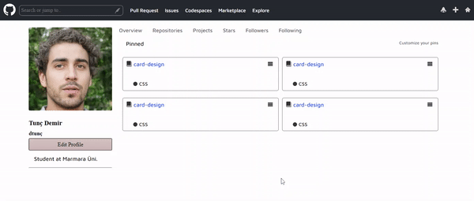

<h1>Github Kullanıcı Ekranı<h1>

Bir kullanıcının profil fotoğrafı ile kişisel bilgilerini içeren ve 
diğer bağlantıların görüntülendiği Github arayüzü üzerine küçük bir çalışma

<h2>KULLANILAN TEKNOLOJİLER</h2>

HTML, CSS, SCSS kullanılmıştır.

<h3>Ekran Görüntüsü</h3>

